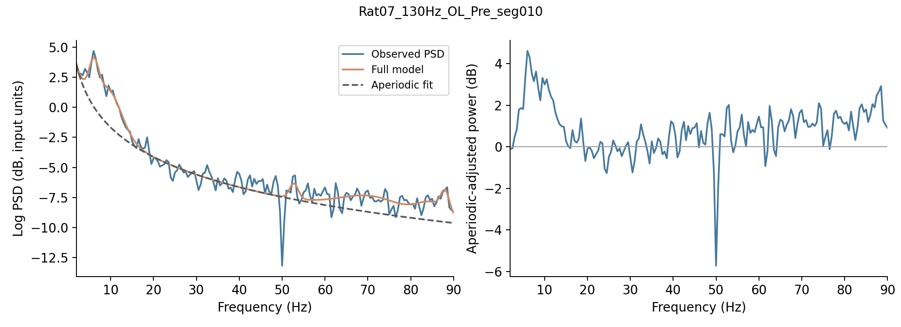
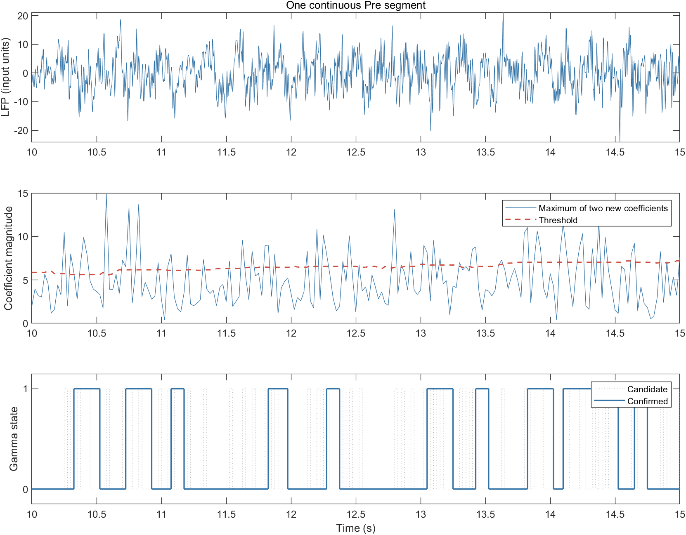

# GATE-Pain · Offline LFP processing examples

Nine consecutively numbered, annotated examples. MATLAB processing remains in
Live Script (`.mlx`) format; Welch/FOOOF analysis remains in Python notebooks
(`.ipynb`). Open one module and read its sections from top to bottom. This is a
small teaching workflow, not an automated rerun of every paper figure.

## Start here

| No. | File | Input → output |
|---|---|---|
| 01 | `step01_preprocess_lfp.mlx` | Continuous signal → filtered 300-Hz record + before/after plots |
| 02 | `step02_segment_and_inspect.mlx` | Preprocessed record → one manually inspected 60-s candidate |
| 03 | `03_welch_psd.ipynb` | Inspected segments → linear Welch PSDs (2-s windows, 50% overlap) |
| 04 | `04_spectral_parameterization.ipynb` | Linear PSDs → knee-mode FOOOF fits, flattened dB spectra, QC |
| 05 | `step05_band_power.mlx` | Fits → six-band power and aperiodic feature table |
| 06 | `step06_rat_level_summary.mlx` | Segment features → within-rat means, own-baseline changes, equal-rat summaries |
| 07 | `step07_offline_gamma_state_detection.mlx` | One continuous segment → WP coefficients, threshold and states |
| 08 | `step08_gamma_state_metrics.mlx` | States → episode durations, occurrences/minute, coverage and ratio |
| 09 | `step09_power_mwt_association.mlx` | Matched rat/day tables → six-band LMM estimates and BH-FDR |

**Spectral route:** 03 → 04 → 05 → 06. **State route:** 07 → 08.
01 → 02 illustrates preprocessing/QC separately. 09 is independent.
The former interpolation step is not included; 05 now means **band power**.

1. In MATLAB, open the selected `.mlx` and choose Run, or run sections in order.
   Set the input path and parameters in section 1. MATLAB does not need a fixed
   drive letter. `step` prefixes keep Live Script names valid MATLAB identifiers.
2. Open Jupyter in this folder; run each notebook's cells top to bottom.
3. Generated files go to `_example_outputs/01_preprocess`, `03_welch`, etc.
   Source files are never overwritten. Rerunning replaces generated examples only.
4. To use your own segment, inspect it in 02, set `qcAccepted=true` with a QC note,
   then choose `input_mode='accepted_step02'` in 03. Set its animal/phase metadata.
   For multiple segments, adapt the example manifest; do not concatenate gaps.

## Examples and selection

Twelve unmodified 60-s MAT segments are copied from the released dataset:
**Rat07 and Rat08, 130-Hz OL, Pre/Stim/Post, two segments per rat and phase**.
Files were selected within these fixed groups for comparatively stable waveforms,
fewer extreme transients and limited 50-Hz peaks, followed by waveform inspection.
No behavioral endpoint, band-change direction or p value was used for selection.
`example_inputs/lfp_examples.csv` records original dataset paths and SHA-256 hashes.
The first Pre segment is used consistently in QC and state-detection examples.
These selected segments do not represent the full animal/phase means in the paper.

## Dependencies

MATLAB syntax targets R2021a or later. Signal Processing Toolbox is needed for
01/02/07; Optimization Toolbox for 01's adaptive notch; Wavelet Toolbox for 07;
Statistics and Machine Learning Toolbox for 09. See `VALIDATION.md` for actual
tested versions. Python dependencies are listed in `requirements.txt`; use
FOOOF 1.1.0 to retain the archived model API.

## Scientific conventions

- Read the real `fs` from each MAT. Release segments are 300 Hz; 07 resamples
  its input to 320 Hz. Do not relabel the data as 500 Hz.
- Input amplitude calibration is not encoded in the segment MATs. Labels use
  input units; integrated linear PSD is in input-unit squared, not assumed µV².
- Welch uses a periodic Hann window, per-window mean detrending, 2-s windows,
  50% overlap and 2–90 Hz. QC spectrograms are separate visual checks.
- Flattened power is the mean dB difference from the aperiodic background,
  using half-open band intervals [low, high), as in the original index masks.
  Absolute power integrates the linear PSD over both endpoints. Gamma is 40–80 Hz.
- FOOOF uses knee mode, widths 2–15 Hz, at most 6 peaks and minimum peak height
  0.20 in native log10 units. Offset is reported in dB; exponent/knee are unchanged.
- No spectral-bin interpolation is included. Archived paper spectra include
  selected interpolated bins; these fresh examples do not claim exact numerical
  reproduction of those archived inputs. Filtering/FOOOF do not certify absence
  of stimulation artifacts. The online Qt package contains real-time processing.
- Segment averaging happens within rat, strategy and phase before equal-rat
  group summaries. Signed flattened-power percentage changes are not percentage
  changes in absolute linear PSD; denominators are exported without stabilization.
- 07 defaults to the described gamma0-gated reference update, holding in gamma1.
  Some archived offline scripts instead use rolling references. A clearly named
  option exposes that difference; the example does not replace archived state
  sequences or claim bit-for-bit Qt replay. Startup/boundary conventions are explicit.
- Warmup is invalid, not gamma0. State rate is 40 updates/s. 08 reports complete
  and boundary-censored episodes separately and uses actual valid recording time,
  not a duration rounded down to minutes. Never join discontinuous segments.
- 09 joins RatID/Day keys and rejects duplicates/mismatches. It uses per-band
  REML random-intercept models and residual degrees of freedom. Six raw p values
  enter one BH-FDR family. Slopes and ordinary CIs are not altered by p adjustment.

## Expected example figures

`example_previews/` contains the actual tested outputs from this version, so you
can inspect the expected waveform, QC, spectral fit and state plots before running.

